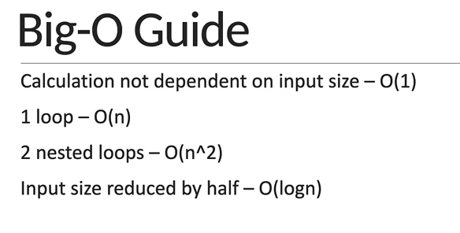
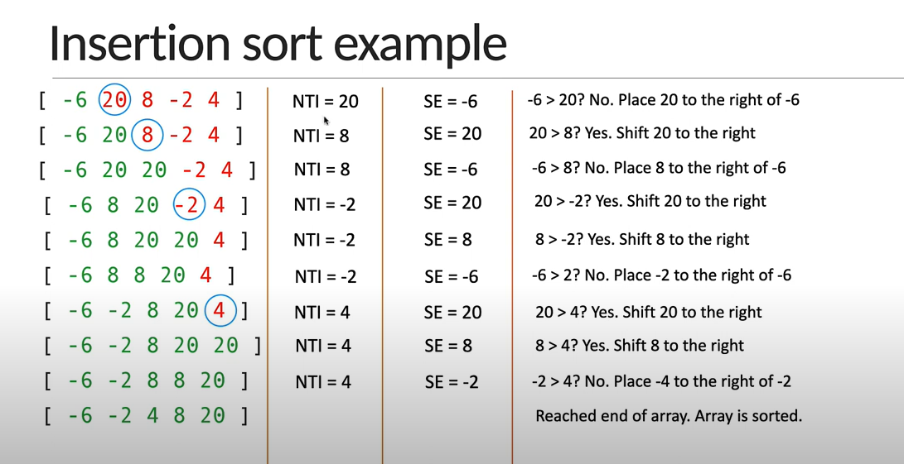

# DSandAlgo
Bio-O Guide
1. Loop - O(n)
2. nested loops - O(n^2)
Input size reduced by half - O(logn)

------------------------------------------------------------------------------------------------------------------------------------------------------------------------------------------------------------------------------------------

JavascriptDSAlgo

Prime number:  A prime number is a number greater than 1 that has no positive divisors other than 1 and itself. In other words, a prime number is only divisible by 1 and the number itself. It cannot be formed by multiplying two smaller natural numbers.

Key Characteristics of Prime Numbers:
A prime number is greater than 1.
A prime number has exactly two distinct divisors: 1 and the number itself.
A number that has more than two divisors is called a composite number.
2, 3, 5, 7, 11, 13, 17, 19, 23, 29, 31, 37, 41, 43, 47, 53, 59, 61, 67, 71, 73, 79, 83, 89, 97

------------------------------------------------------------------------------------------------------------------------------------------------------------------------------------------------------------------------------------------

Fibonacci Numbers
The Fibonacci sequence is a series of numbers in which each number is the sum of the two preceding ones. The sequence starts with 0 and 1 (or sometimes, depending on convention, it starts with 1 and 1). Each subsequent number in the sequence is the sum of the two previous numbers.

Fibonacci Sequence Definition:
The sequence starts as:

Copy
0, 1, 1, 2, 3, 5, 8, 13, 21, 34, 55, 89, 144, 

------------------------------------------------------------------------------------------------------------------------------------------------------------------------------------------------------------------------------------------
Factorial Numbers
In mathematics, the factorial of a non-negative integer n is the product of all positive integers less than or equal to n. It is denoted by n!.

Definition:
n! = n × (n - 1) × (n - 2) × ... × 3 × 2 × 1
0! = 1 (by definition)
Factorial is only defined for non-negative integers.
Examples:
0! = 1
1! = 1
2! = 2 × 1 = 2
3! = 3 × 2 × 1 = 6
4! = 4 × 3 × 2 × 1 = 24
5! = 5 × 4 × 3 × 2 × 1 = 120

-----------------------------------------------------------------------------------------------------------------------------------------------------------------------------------------------------------------------------------------

Insertion sort

